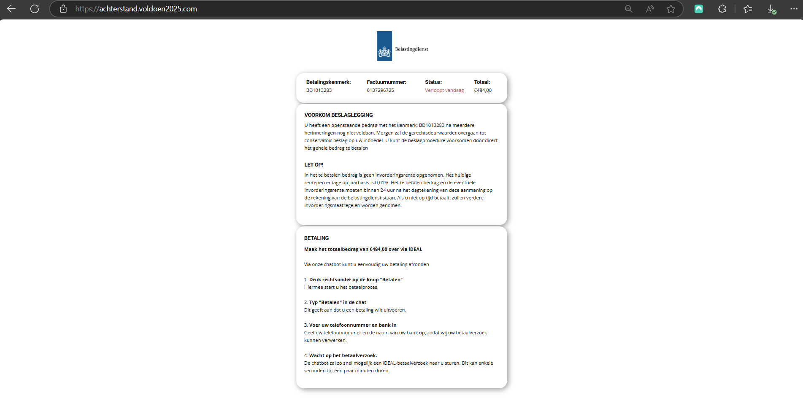

# achterstand.voldoen2025.com
**Scam Date**: February, 2025  

**Scam Summary**:  
Victims receive a message advising to quickly pay a non-existing debt in order to prevent legal actions. The message reads:

> "Belastingdienst: Betaal €475,00 voor 11-02-2025 om beslag te voorkomen. Betaal via https://achterstand.voldoen2025.com"

**Translation**:  
> "Belastingdienst: Pay €475,00 before 11-02-2025 to avoid seizure. Pay via https://achterstand.voldoen2025.com"

---

### Source Analysis:
The message claims to be from a Dutch debt collection service and attempts to mimic the **Belastingdienst** (Dutch Tax Office). The sender advises the victim to pay their (non-existing) debt in order to prevent legal actions. When the intended victim goes to https://achterstand.voldoen2025.com they are shown a fake invoice and are given the option to pay when they open the chat. In the victim needs to enter the name of their bank and their telephonenumber. In the chat the victim is being presented an iDEAL-payment link to pay their non-existend debt.

**Scam Tactics**:  
- **Mimicked Invoice**: The website displays a fake invoice, imitating the Dutch Tax Office, demanding immediate payment.  
- **Chatbot**: Victims are instructed to provide personal details in the form of a chatbot, likely for data harvesting. 
- **Fake iDeal Payment**: After entering their details in the chat, victims are provided an iDeal link:

### Actions Taken:
1. **Nicenic.net** has been informed and the Dutch Tax Office (Belastingdienst) has been notified through valse-email@belastingdienst.nl,
2. **Google Safe Search** has been informed of this fraudulent website,
3. **Cloudflare** has been informed of this fraudulent website,
4. **Tidio.net** has been informed of the use of their services on their website,
5. **Nicepage.io** has been informed that their service was used to create a fraudulent website.

### Follow-Up:

### Lessons & Takeaways:

1. **Source Red Flags**: Any unsolicited messages threatening immediate legal action or financial penalties should be treated with extreme caution.
2. **Domain Name Red Flags**: The domain **mijn-schulden.com** is suspicious. Official Dutch services would rather use **.nl** domain extensions, not **.com**.
3. **Immediate Threats**: Scammers often use fear tactics (e.g., seizure of assets) to manipulate victims into immediate action without verifying the legitimacy of the claim.
4. **Verify Payment Links**: Always check the origin of payment links, especially if directed to iDeal or other payment gateways via suspicious means.
5. **Stay Informed**: Regularly check with official agencies (like the Dutch Tax Office) regarding any real outstanding debts. Scams often use urgency to force victims into compliance.
6. **Report Phishing**: If you receive such scams, report them to relevant authorities like domain registrars, hosting providers, and payment services to minimize the damage done.

