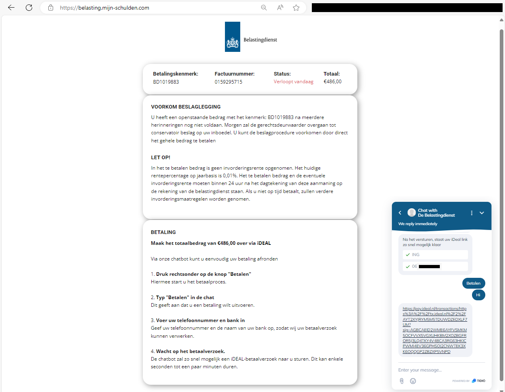

# Scam Report: belasting.mijn-schulden.com

**Scam Date**: January, 2025  
**Status**: Resolved  

---

## Scam Summary  
Victims receive a message claiming to be from the Dutch Tax Office (**Belastingdienst**), urging them to pay a non-existent debt immediately to avoid legal consequences. The fraudulent message directs victims to a fake website where they are tricked into entering personal details and making a payment via a fake iDEAL link.

---

## Scam Message (Example from Victim)  
> "Belastingdienst: Betaal €486,00 voor 09-01-2025 om beslag te voorkomen. Betaal via belasting.mijn-schulden.com"  

**Translation:**  
> "Belastingdienst: Pay €486,00 before 09-01-2025 to avoid seizure. Pay via https://belasting.mijn-schulden.com"

---

## Source Analysis  
- **Impersonated Entity**: Dutch Tax Office (**Belastingdienst**)
- **Scammer's Contact Method**: SMS message
- **Website Used**: [belasting.mijn-schulden.com](https://belasting.mijn-schulden.com)
- **Hosting Provider/Registrar**: [Nicenic.net](https://nicenic.net) (Reported)

---

## Scam Tactics  

### 1. Impersonation & Fear Tactics  
- The message mimics the **Belastingdienst** to appear legitimate.
- Urgent threats of legal action (e.g., asset seizure) pressure victims into acting immediately.

### 2. Fraudulent Website & Payment Link  
- The fake website displays a fraudulent invoice claiming immediate payment is required.
- Visitors are prompted to enter personal details, such as their **bank name** and **phone number**.
- A chatbot is used to provide an **iDEAL payment link**, which leads to a fraudulent transaction.

  

### 3. Fake Customer Support or Chatbot  
- A chatbot engages with victims, making the scam appear more credible.
- The chatbot requests sensitive information before providing a fraudulent payment link.

---

## Actions Taken  

### 1. Domain & Hosting Reports  
- Reported the domain **belasting.mijn-schulden.com** to **Nicenic.net**.
- Informed **Google Safe Search** of the fraudulent website.
- Reported the fraudulent use of **Cloudflare protection**.
- Notified **Tidio.net** regarding their chatbot being used on the scam site.
- Alerted **Nicepage.io** that their service was exploited to create the fraudulent site.

---

## Follow-Up & Status Updates  
- **January 2025**: Scam reported to relevant authorities.
- **January 2025**: Cloudflare and Google Safe Search flagged the site as a scam.
- **January 2025**: The fraudulent domain was taken down, stopping further scams.

---

## Lessons & Takeaways  

### 1. Red Flags & Prevention  
- **Urgent threats demanding immediate payment** → Verify directly with the organization.
- **Suspicious domains** → Dutch government services primarily use **.nl** domains.
- **Fake chatbots & unverified payment links** → Never provide personal details to unsolicited contacts.

### 2. How to Stay Safe  
- **Do not trust SMS/email messages with urgent legal threats.**
- **Always verify domain legitimacy before entering sensitive data.**
- **Report scams to authorities to prevent further victims.**

### 3. Ongoing Scam Awareness  
For more scam awareness and reporting guides:
- [**Social Media Scams**](../General/SocialMediaScam.md)  
- [**Telephone Fraud**](../General/Telefonische_fraude.md)  
- [**Deep Dive into Scamming**](../General/Dive_into_scamming.md)  

---

## Get Involved  
If you've encountered similar scams, report them to the appropriate authorities.  
For a full list of fraud reporting platforms, visit:  

- [**How to Report Scams**](../General/GetInvolved.md)  

By reporting scams, you help authorities track down criminals, prevent further victims, and contribute to shutting down fraudulent networks.

**Stay alert. Stay informed. Stay safe.**
