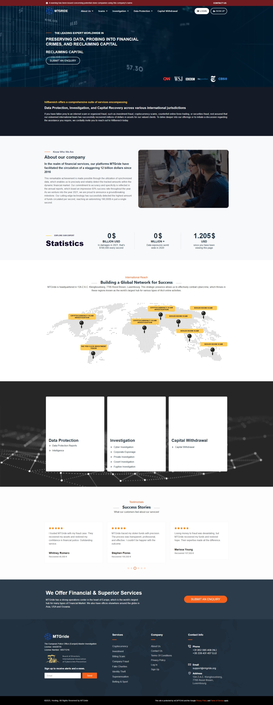
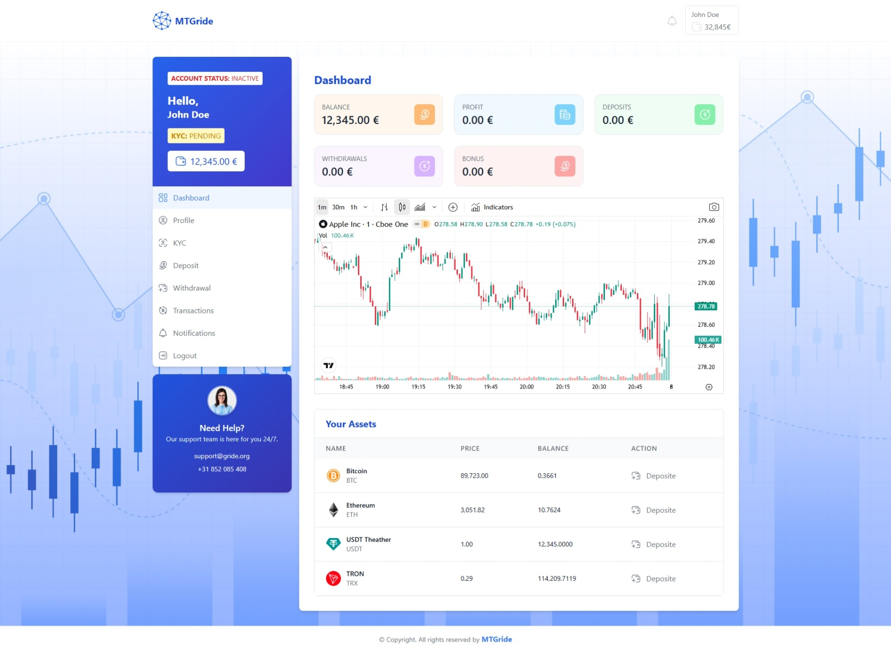

# Scam Report: MTGride Crypto Investment Scam

**Scam Date**: November 2025  
**Status**: Ongoing

---
## Scam Summary  
This is a sophisticated cryptocurrency investment scam where fraudsters cold-call victims claiming to have detected suspicious transactions on their accounts. The scammers deliberately avoid naming which platform was supposedly compromised, then ask victims about cryptocurrency investments they may have made in the past. Victims are directed to a fake website (mtgride.org) where they are shown fabricated account balances to make them believe they have significant crypto holdings. The dashboard displays inflated balances (e.g., €32,845.00) with account status marked as "Inactive" and KYC status as "Pending" to create urgency and justify requests for verification fees or payments.

The landing page fraudulently displays logos of major news media outlets (CNN, Wall Street Journal, BBC, the Guardian, Daily Telegraph and CBS) to falsely suggest media coverage and legitimacy. The site positions itself as a "capital recovery" and "financial crimes investigation" service.

---
## Screenshots

*Landing page showing fraudulent use of news media logos and false claims about capital recovery services*

*Fake account dashboard with fabricated balance and status indicators (anonymized)*

---
## Source Analysis  
- **Impersonated Entity**: Capital recovery and financial crimes investigation service
- **Media Brands Misused**: CNN, Wall Street Journal, BBC, the Guardian, Daily Telegraph and CBS
- **Scammer's Contact Method**: Phone Call / Website
- **Phone Numbers Used**: 
  - +31 852 085 408 (listed on dashboard - not answering calls)
  - +31 852 430 761 (listed on landing page)
- **Email Addresses Used**:
  - support@mtgride.org
  - support@gride.org
- **Website/Phone Number Used**: 
  - mtgride.org
  - account.mtgride.org (subdomain - login portal)
- **Carrier / Hosting Provider**: 
  - Hosting: Virtual Systems LLC (Ukraine) - IP 176.97.124.90
  - Registrar: Hosting Concepts B.V. via Registrar.eu
  - CDN: Cloudflare

---
## Scam Tactics  
### 1. Cold Call Social Engineering  
The scammers initiate contact by phone, claiming to represent a financial institution that has detected suspicious activity. They deliberately remain vague about which platform is involved and lure the victim towards the website that's under their control.

### 2. False Media Credibility
The landing page displays logos of major news organizations (CNN, Wall Street Journal, BBC, the Guardian, Daily Telegraph and CBS) to create a false impression of media coverage and legitimacy. This trademark misuse is designed to make victims believe the platform has been featured or endorsed by these trusted news sources.

### 3. Capital Recovery Deception
The site positions itself as "THE LEADING EXPERT WORLDWIDE IN PRESERVING DATA, PROBING INTO FINANCIAL CRIMES, AND RECLAIMING CAPITAL" - falsely claiming to be a legitimate recovery service. This creates confusion and makes victims believe they are dealing with a professional organization that can help recover lost funds, when in reality it's the scam operation itself.

### 4. Fake Global Presence
The landing page displays a world map showing office locations in Luxembourg, London, Moscow, Hong Kong, Middle East, and South Korea to create an impression of international legitimacy and scale.

### 5. Fake Investment Dashboard  
Victims are directed to account.mtgride.org, a fraudulent website built on WordPress that displays:
- **Fabricated account balances** (example shown: €12,345.00 balance)
- **Fake cryptocurrency holdings**:
  - Bitcoin (BTC): 0.3661 BTC
  - Ethereum (ETH): 10.7624 ETH
  - USDT Tether: 12,345.0000 USDT
  - TRON (TRX): 114,209.7119 TRX
- **Account status indicators** showing "Inactive" status in yellow
- **KYC verification status** marked as "Pending" in yellow
- **Professional interface** with navigation menu (Dashboard, Profile, KYC, Deposit, Withdrawal, Transactions, Notifications, Logout)
- **Trading chart** showing stock data (Apple Inc) to appear sophisticated
- **24/7 support claims** with contact information

### 6. TradingView Chart Misuse
The dashboard incorporates trading charts that appear to use TradingView's charting technology or styling to display stock data (Apple Inc). This misuse of TradingView's brand and technology is designed to make the fake platform appear more sophisticated and legitimate.

### 7. Psychological Manipulation Through Status Indicators
The fake dashboard uses several psychological triggers:
- **"ACCOUNT STATUS: Inactive"** - Creates urgency to "activate" the account
- **"KYC: Pending"** - Justifies requests for identity documents and verification fees
- **Prominent balance display** - Shows large cryptocurrency holdings to motivate victims to pay fees
- **Multiple cryptocurrency assets** - Makes the account appear more valuable and legitimate
- **Deposit and Withdrawal sections** - Encourages victims to add more funds or attempt withdrawals (which will be blocked)
- **Professional design elements** - Uses modern UI, charts, and statistics to appear legitimate

### 8. Technical Deception  
The scam website uses:
- WordPress 6.9 with Elementor theme (not typical for legitimate financial services)
- Alpine.js for interactive elements
- Let's Encrypt SSL certificate (provides false sense of security)
- Cloudflare CDN (obscures true hosting location)
- Professional-looking design with charts, statistics, and modern styling
- CSRF tokens and form validation to appear secure

### 9. Unresponsive Contact Numbers
The phone numbers listed on the site (+31 852 085 408 and +31 852 430 761) do not answer calls, suggesting they are either:
- Not taking calls at the moment
- Display-only numbers used for credibility
- Numbers that only make outbound calls to victims
- VoIP numbers that can be easily changed or abandoned

---
## Actions Taken  
### 1. Evidence Collection  
- **December 2025**: Captured website evidence including WHOIS data, DNS records, SSL certificate information, website structure analysis, authenticated dashboard interface, and screenshots of landing page and account dashboard.

### 2. Technical Analysis Completed  
- Identified domain registration date: November 20, 2025
- Documented hosting infrastructure and security vulnerabilities
- Analyzed website technology stack (WordPress-based with Alpine.js)
- Captured dashboard interface showing fake balance displays and cryptocurrency holdings
- Documented fraudulent use of news media logos
- Documented misuse of TradingView charting technology/styling
- Investigated phone numbers (not answering calls)

### 3. Brand Notification
The following organizations are being notified of trademark/brand misuse:

**News Media Organizations:**
- CNN
- Wall Street Journal
- BBC
- the Guardian
- Daily Telegraph
- CBS

**Technology/Service Providers:**
- TradingView (https://www.tradingview.com/) - Notified of unauthorized use of their charting technology/styling

---
## Lessons & Takeaways  
### 1. Red Flags & Prevention  
- **Recently registered domain**: Domain was registered November 20, 2025 (check registration date at whois.com)
- **Vague initial contact**: Legitimate institutions specify which platform/account is affected
- **WordPress-based platform**: Real financial services use custom-built platforms, not WordPress
- **Unsolicited contact about old investments**: Legitimate platforms don't cold-call about dormant accounts
- **News media logos without articles**: Displaying logos doesn't mean actual media coverage - check for real articles
- **Unresponsive phone numbers**: Legitimate businesses answer their published phone numbers
- **"Capital recovery" claims**: Often used by scammers to target previous scam victims (recovery scam)
- **"Inactive" account status**: Scammers use this to justify activation fees
- **"Pending" KYC status**: Know Your Customer, used to request identity documents and verification
- **Fee requests**: Real services deduct fees from your balance, never request upfront payments
- **Free SSL certificate**: Major financial platforms use Extended Validation (EV) certificates showing company name in browser
- **Fabricated balances**: If you don't recognize the platform or remember creating an account, the balance is fake
- **Multiple office locations**: Easy to claim global presence without actual offices

### 2. Dashboard Warning Signs
- **Account status manipulation**: "Inactive" or "Pending" statuses designed to create urgency
- **Unrealistic balances**: Large cryptocurrency holdings shown to motivate fee payments
- **Deposit and withdrawal sections on "inactive" accounts**: Real platforms don't allow transactions on inactive accounts
- **Generic user interface**: Lacks specific transaction history or verifiable blockchain addresses
- **No withdrawal functionality**: Despite showing balances, actual withdrawal is blocked or requires fees
- **Stock trading charts on crypto platform**: Mixing unrelated financial instruments to appear sophisticated

### 3. How to Stay Safe  
- Never trust unsolicited calls about cryptocurrency investments or "capital recovery"
- Verify any platform independently by searching for official contact information
- Check domain registration dates using WHOIS lookup tools
- Real financial services never request upfront fees for withdrawals or account activation
- If you haven't used a platform in years, contact them directly through official channels
- Be suspicious of platforms you don't recognize or remember creating accounts with
- Never provide wallet keys, seed phrases, or personal documents to verify "accounts"
- Legitimate platforms show detailed transaction history with blockchain verification
- If an account shows as "inactive," legitimate platforms reactivate it automatically upon login
- Verify media coverage claims by searching for actual articles on the news organization's website
- Test phone numbers before trusting them - legitimate businesses answer their published numbers
- Be wary of "capital recovery" services contacting you - these are often secondary scams targeting previous victims

---
## Technical Indicators  
For investigators and security professionals:

**Domain Information:**
- Domain: mtgride.org
- Subdomain: account.mtgride.org (login portal)
- Registrar: Hosting Concepts B.V. (Netherlands)
- Name Servers: ns1.v-sys.org, ns2.v-sys.org
- Status: clientTransferProhibited
- Registration Date: November 20, 2025

**Infrastructure:**
- IP Address: 176.97.124.90
- Hosting: Virtual Systems LLC (Ukraine)
- CDN: Cloudflare
- CMS: WordPress 6.9
- Theme: Elementor
- JavaScript Framework: Alpine.js 3.13.3

**Contact Information (Scam):**
- Phone: +31 852 085 408 (not answering calls)
- Phone: +31 852 430 761
- Email: support@mtgride.org
- Email: support@gride.org

**Dashboard Features:**
- Fake balance display system (€32,845.00 shown)
- Fake cryptocurrency holdings (BTC, ETH, USDT, TRX)
- Account status indicators (Inactive/Active)
- KYC status system (Pending/Verified)
- Navigation sections: Dashboard, Profile, KYC, Deposit, Withdrawal, Transactions, Notifications, Logout
- Trading chart integration (stock data - appears to use TradingView styling)
- CSRF token implementation
- 24/7 support claims
- Logout functionality

**Landing Page Claims:**
- "Leading expert worldwide" in data protection, financial crimes investigation, and capital recovery
- Fake office locations: Luxembourg, London, Moscow, Hong Kong, Middle East, South Korea
- Services: Data Protection, Investigation, Capital Withdrawal
- Success stories and testimonials (fabricated)

**Security Posture:**
- SSL: Let's Encrypt (free certificate)
- No DNSSEC
- Basic SPF record only
- DMARC policy: none
- XML-RPC enabled (vulnerability)

**Abuse Contacts:**
- Registrar: abuse@registrar.eu
- Hosting: abuse@v-sys.org
- Cloudflare: abuse@cloudflare.com
- .org Registry: abuse@pir.org

**Technology/Service Provider Contacts:**
- TradingView: https://www.tradingview.com/support/solutions/43000529348-report-abuse/

**Phone Number Investigation:**
- Check provider at: https://www.acm.nl/nl/telefoonnummers-zoeken
- Report to provider if identified

---
## Ongoing Scam Awareness  
For more related topics and scam breakdowns, visit:  
- [**Cryptocurrency Scams**](../General/CryptoScams.md)  
- [**Investment Fraud**](../General/InvestmentFraud.md)
- [**Phone Scams**](../General/PhoneScams.md)
- [**Phishing & Fake Websites**](../General/PhishingScams.md)
- [**Recovery Scams**](../General/RecoveryScams.md)

---
## Get Involved  
If you've encountered this scam or similar operations, please report them:

**Netherlands:**
- Politie: https://www.politie.nl/aangifte-of-melding-doen
- Fraudehelpdesk: https://www.fraudehelpdesk.nl
- ACM (Autoriteit Consument & Markt): https://www.acm.nl
- Phone number provider lookup: https://www.acm.nl/nl/telefoonnummers-zoeken

**International:**
- EUROPOL: ec3.contact@europol.europa.eu
- Your local police department

**Report Media Brand Misuse:**
- CNN: https://www.cnn.com/feedback
- Wall Street Journal: wsjcontact@dowjones.com
- BBC: https://www.bbc.co.uk/contact
- the Guardian: https://www.theguardian.com/info/contact-us
- Daily Telegraph: https://www.telegraph.co.uk/contact-us/
- CBS: https://www.cbs.com/feedback/

**Report Technology/Service Misuse:**
- TradingView: https://www.tradingview.com/support/solutions/43000529348-report-abuse/

See: [**How to Report Scams**](../General/GetInvolved.md)

**Stay alert. Stay informed. Stay safe.**
